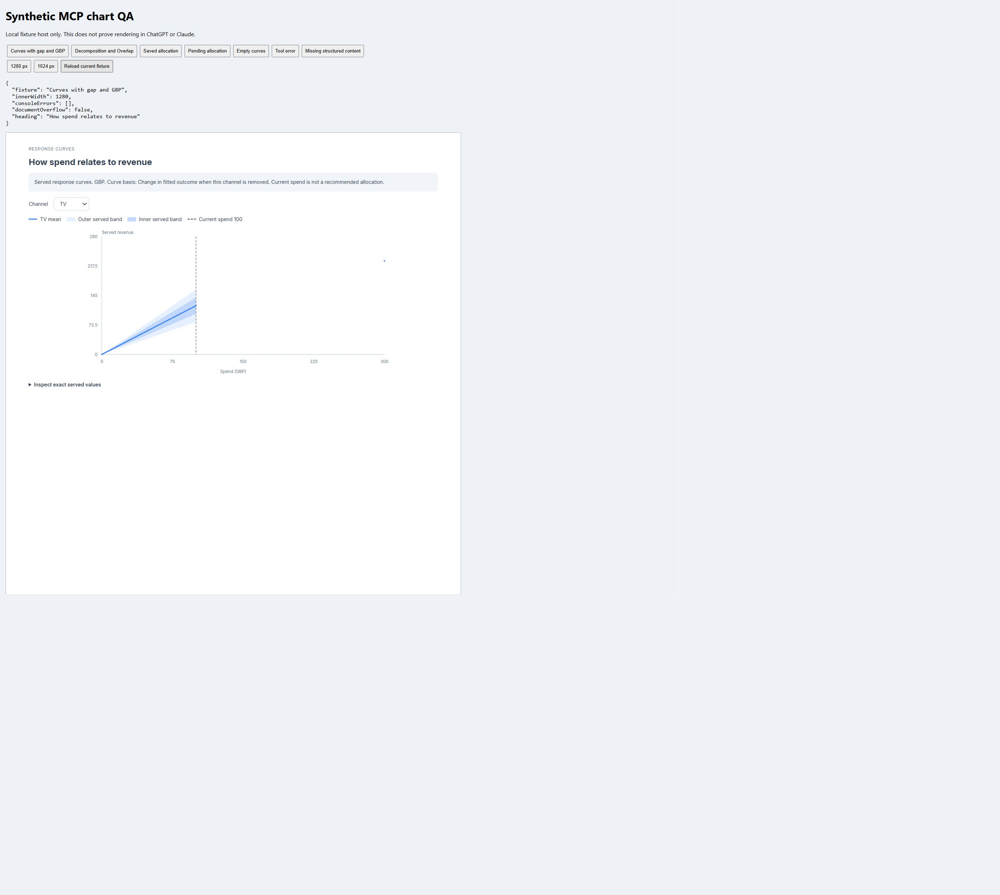
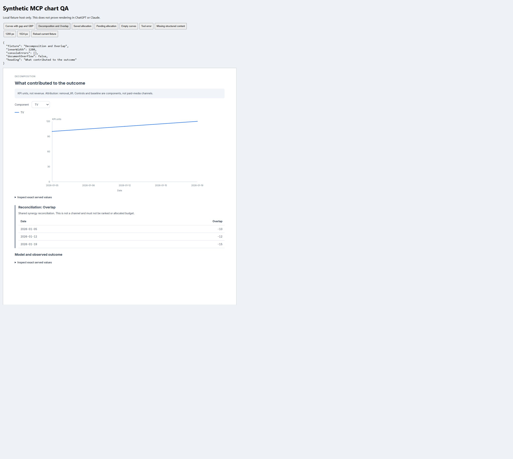

# Native result charts

> **Available in [Simba MCP v0.16.0](https://github.com/getsimba-ai/simba-mcp/releases/tag/v0.16.0), published on [PyPI](https://pypi.org/project/simba-mcp/0.16.0/).** Your connected MCP server must provide v0.16.0 or a later compatible release, with a compatible backend and an MCP Apps-capable client. Package publication does not upgrade a hosted server: check its version and tool list. Native-client acceptance has not yet been observed and is recorded separately.

Three read-only tools display existing results in hosts that support MCP Apps:

| Tool | Inputs | View |
| --- | --- | --- |
| `show_response_curves` | `model_hash` | Response curves, served uncertainty and current spend where available |
| `show_decomposition` | `model_hash` | Contribution series in KPI units, with Overlap separately identified |
| `show_optimizer_allocation` | `model_hash`, optional `run_id` | Saved allocation spend and separate decision/comparison tables |

Example prompts:

- "Show the response curves for model SYNTHETIC_MODEL. Explain any missing data."
- "Show the contribution decomposition for model SYNTHETIC_MODEL. Keep reconciliation terms separate."
- "Show allocation run SYNTHETIC_RUN for model SYNTHETIC_MODEL. Distinguish decision revenue from accounting comparison."

Replace these placeholders with authorised identifiers returned by `list_models` and `list_runs`. The tools do not create models, fit results or change budgets. Supplying a run ID selects that saved run; omitting it reads the model's latest allocation result.

The view uses only returned values. Missing observations remain gaps. Legacy response grids with fewer than three finite points are disclosed rather than repaired or interpolated. Exact-value tables expose the supplied numbers. A current-spend marker is not an allocation recommendation. Response-curve reference levels and headline mROI can differ, so the view does not substitute one for the other.

Decomposition values are KPI units, not revenue. `Overlap` is a reconciliation term, not a channel. Allocation `Revenue` and `ROI` are decision quantities; `OptimizedEvalRevenue`, `OptimizedEvalROI`, `HistoricalRevenue` and `HistoricalROI` are accounting comparison quantities. These are presented in separate tables without computing uplift.

See the [v0.16.0 tool reference](https://github.com/getsimba-ai/simba-mcp/blob/v0.16.0/docs/tools.md) for this version's chart contract. Compare it with your connected server's version and tool list before using the examples.

## Compatibility and security

The server advertises `ui://simba/charts.html` with the MCP Apps MIME type `text/html;profile=mcp-app`. The packaged HTML contains inline SVG and script, requires no external resources and declares an empty resource CSP. No credentials enter the iframe. The existing structured and text results remain useful on clients without Apps rendering support.

The implementation follows the [MCP Apps lifecycle](https://apps.extensions.modelcontextprotocol.io/api/documents/Overview.html) and the [shared MCP Apps UI protocol supported by ChatGPT](https://developers.openai.com/plugins/build/chatgpt-ui). Documented protocol support is distinct from acceptance in a particular account or client version.

Automated fixture rendering covers the three views and missing-data conventions. Actual native-host acceptance has not yet been observed and is recorded separately. Do not describe an ordinary browser fixture screenshot as a live client screenshot.

## Synthetic browser examples

These screenshots show the packaged view in a **local synthetic test host at a measured 1280-pixel viewport**. They are fixture evidence, not screenshots of native rendering in Claude or ChatGPT. Values are synthetic and do not represent a fitted customer model.

The response view keeps missing values as gaps and exposes the served numeric values.

The decomposition view separates Overlap into a reconciliation panel rather than presenting it as a channel.
